#  Arquitectura del Sistema E-Commerce Microservices

**Fecha:** Diciembre 2025  
**Autores:** David Santiago Malte, Santiago Ángel, Samuel Ibarra

---

##  Tabla de Contenidos

1. [Introducción](#introducción)
2. [Arquitectura de Alto Nivel](#arquitectura-de-alto-nivel)
3. [Arquitectura de Microservicios](#arquitectura-de-microservicios)
4. [Arquitectura de Infraestructura](#arquitectura-de-infraestructura)
5. [Patrones de Diseño Implementados](#patrones-de-diseño-implementados)
6. [Flujos de Comunicación](#flujos-de-comunicación)
7. [Decisiones Técnicas](#decisiones-técnicas)
8. [Screenshots de Arquitectura](#screenshots-de-arquitectura)

---

##  Introducción

Este documento describe la arquitectura completa del sistema de e-commerce basado en microservicios, desplegado en Google Cloud Platform utilizando Kubernetes (GKE) y siguiendo las mejores prácticas de diseño cloud-native.

### Objetivos de la Arquitectura

-  **Escalabilidad horizontal**: Cada microservicio puede escalar independientemente
-  **Resiliencia**: Circuit breakers y fallbacks para tolerancia a fallos
-  **Observabilidad**: Logs centralizados, métricas y distributed tracing
-  **Despliegue continuo**: CI/CD automatizado con Jenkins
-  **Seguridad**: Network policies, secrets management, RBAC

---

##  Arquitectura de Alto Nivel

### Vista General del Sistema
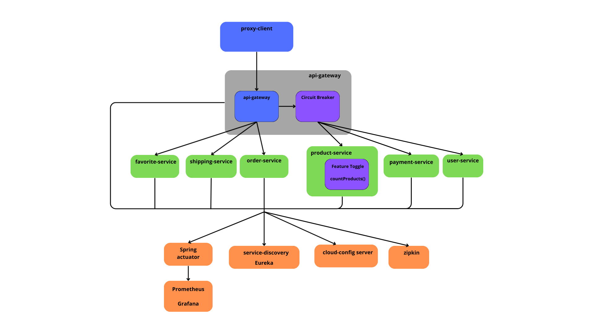


```bash
# Comando para capturar arquitectura general
gcloud compute instances list
gcloud container clusters list
kubectl get namespaces
kubectl get all -n dev
``` 
> **Descripción:** Vista de todos los recursos desplegados en GCP

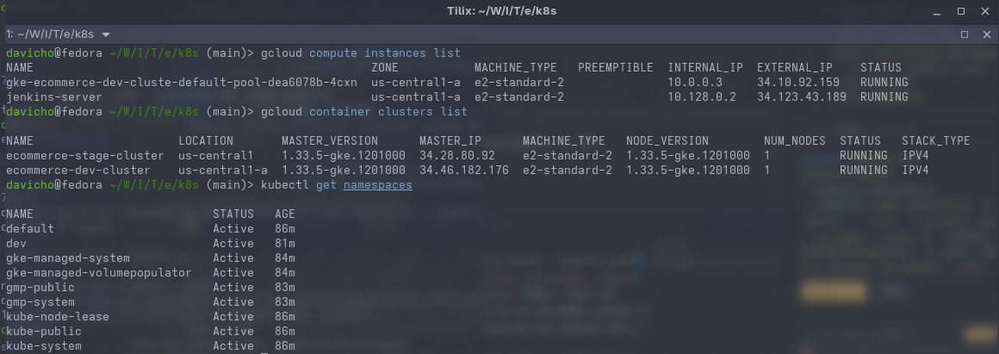
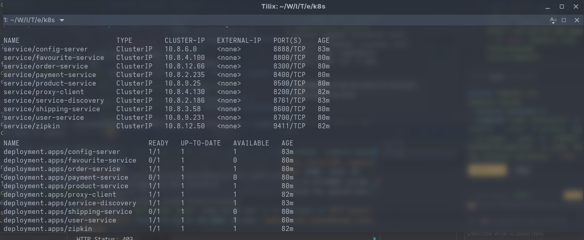

---

## Arquitectura de Microservicios

### Descripción de Microservicios

#### 1. **Infrastructure Services**

##### a) Service Discovery (Eureka Server)
- **Puerto:** 8761
- **Propósito:** Registro y descubrimiento de servicios
- **Tecnología:** Spring Cloud Netflix Eureka
- **Réplicas:** 2 (alta disponibilidad)
- **Dependencias:** Ninguna

**Funcionalidad:**
- Registro automático de servicios al iniciar
- Health checks periódicos
- Balanceo de carga cliente-side
- Failover automático

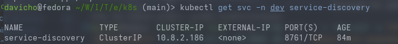
```bash
# Acceder a Eureka Dashboard
kubectl get svc -n dev service-discovery
# Abrir navegador en: http://<EXTERNAL-IP>:8761
```
> **Descripción:** Dashboard de Eureka mostrando todos los servicios registrados

##### b) Config Server
- **Puerto:** 8888
- **Propósito:** Configuración centralizada
- **Tecnología:** Spring Cloud Config Server
- **Backend:** Git repository o Cloud Storage
- **Réplicas:** 1 (suficiente para DEV)

**Configuraciones gestionadas:**
- Application properties por ambiente
- Database connections
- Service URLs
- Feature toggles

##### c) API Gateway (Proxy Client)
- **Puerto:** 8200
- **Propósito:** Punto de entrada único
- **Tecnología:** Spring Cloud Gateway
- **Funcionalidades:**
  - Routing dinámico
  - Load balancing
  - Rate limiting
  - Authentication/Authorization (futuro)

**Rutas configuradas:**
```yaml
/api/user-service/**    → user-service:8700
/api/product-service/** → product-service:8500
/api/order-service/**   → order-service:8300
/api/payment-service/** → payment-service:8400
/api/shipping-service/** → shipping-service:8600
/api/favourite-service/** → favourite-service:8800
```


##### d) Zipkin (Distributed Tracing)
- **Puerto:** 9411
- **Propósito:** Rastreo de transacciones distribuidas
- **Tecnología:** Zipkin Server
- **Storage:** In-memory (DEV), Elasticsearch (PROD)


```bash
# Acceder a Zipkin UI
kubectl get svc -n dev zipkin

```
> **Descripción:** Trace de una transacción completa (user → product → order → payment)

#### 2. **Business Services**

##### a) User Service
- **Puerto:** 8700
- **Base de Datos:** MySQL/PostgreSQL
- **Endpoints principales:**
  - `GET /users` - Listar usuarios
  - `GET /users/{id}` - Obtener usuario
  - `POST /users` - Crear usuario
  - `PUT /users/{id}` - Actualizar usuario
  - `DELETE /users/{id}` - Eliminar usuario

**Dependencias:**
- Service Discovery (para registro)
- Config Server (para configuración)

##### b) Product Service
- **Puerto:** 8500
- **Base de Datos:** MySQL/PostgreSQL
- **Endpoints principales:**
  - `GET /products` - Catálogo de productos
  - `GET /products/{id}` - Detalle de producto
  - `POST /products` - Crear producto
  - `PUT /products/{id}/stock` - Actualizar inventario


##### c) Order Service
- **Puerto:** 8300
- **Base de Datos:** MySQL/PostgreSQL
- **Endpoints principales:**
  - `POST /orders` - Crear pedido
  - `GET /orders/{id}` - Consultar pedido
  - `PUT /orders/{id}/status` - Actualizar estado

**Comunicación con otros servicios:**
```
Order Service → Product Service (verificar stock)
Order Service → Payment Service (procesar pago)
Order Service → Shipping Service (crear envío)
```

##### d) Payment Service
- **Puerto:** 8400
- **Integración:** Stripe/PayPal (simulado)
- **Endpoints principales:**
  - `POST /payments` - Procesar pago
  - `GET /payments/{id}` - Estado de pago
  - `POST /payments/{id}/refund` - Reembolso


##### e) Shipping Service
- **Puerto:** 8600
- **Integración:** FedEx/UPS (simulado)
- **Endpoints principales:**
  - `POST /shipments` - Crear envío
  - `GET /shipments/{id}` - Rastrear envío
  - `PUT /shipments/{id}/status` - Actualizar estado

##### f) Favourite Service
- **Puerto:** 8800
- **Propósito:** Lista de favoritos de usuarios
- **Endpoints principales:**
  - `GET /favourites/user/{userId}` - Lista de favoritos
  - `POST /favourites` - Agregar favorito
  - `DELETE /favourites/{id}` - Eliminar favorito


---

##  Arquitectura de Infraestructura

### Google Cloud Platform Resources

#### 1. **GKE Standard Cluster**

**Configuración DEV:**
```hcl
resource "google_container_cluster" "ecommerce_dev" {
  name     = "ecommerce-dev-cluster"
  location = "us-central1"
  
  # GKE Standard configuration
  initial_node_count = 1
  
  node_config {
    machine_type = "e2-medium"
    disk_size_gb = 50
    disk_type    = "pd-standard"
    
    oauth_scopes = [
      "https://www.googleapis.com/auth/cloud-platform"
    ]
  }
  
  ip_allocation_policy {
    cluster_ipv4_cidr_block  = "10.0.0.0/16"
    services_ipv4_cidr_block = "10.1.0.0/16"
  }
  
  maintenance_policy {
    recurring_window {
      start_time = "2024-01-01T00:00:00Z"
      end_time   = "2024-01-01T04:00:00Z"
      recurrence = "FREQ=WEEKLY;BYDAY=SU"
    }
  }
}
```

**Características:**
- ✅ Control total sobre configuración de nodos
- ✅ Node pools personalizables
- ✅ Configuración manual de auto-scaling
- ✅ Flexibilidad en machine types y recursos
- ✅ Preemptible nodes para optimización de costos

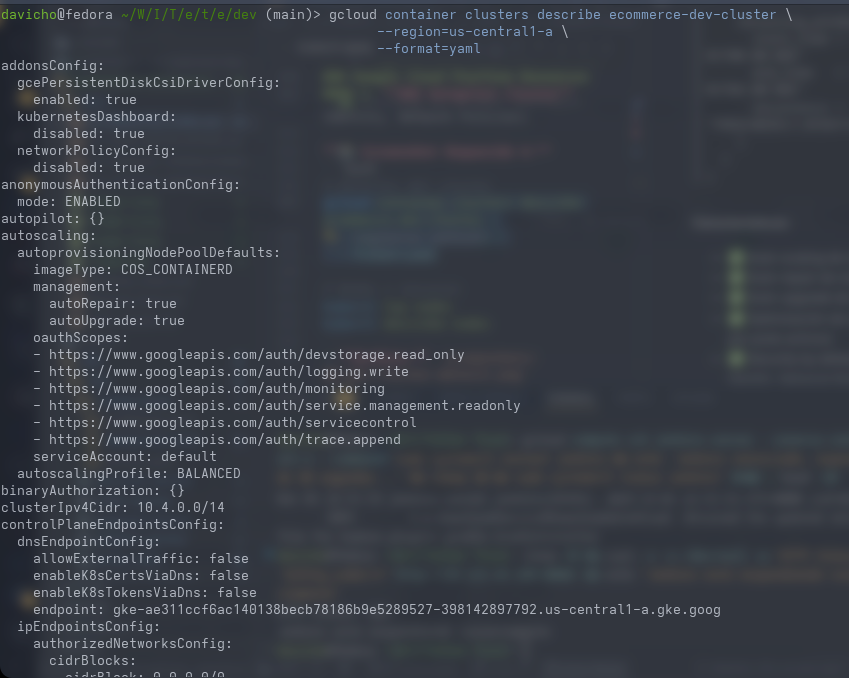
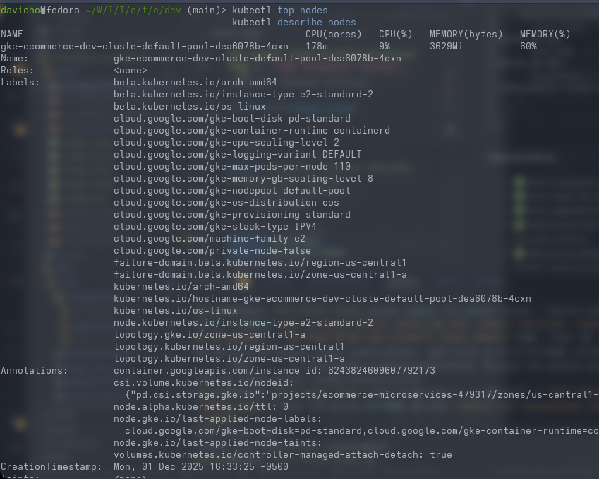

```bash
# Detalles del cluster
gcloud container clusters describe ecommerce-dev-cluster \
  --region=us-central1 \
  --format=yaml

# Nodes y recursos
kubectl top nodes
kubectl describe nodes
```

#### 2. **Artifact Registry**

**Configuración:**
```
Repository: ecommerce-repo
Format: Docker
Location: us-central1
Project ID: ecommerce-microservices-479317
Description: Docker images para microservicios

Images stored:
  - service-discovery:latest
  - config-server:latest
  - api-gateway:latest
  - user-service:latest
  - product-service:latest
  - order-service:latest
  - payment-service:latest
  - shipping-service:latest
  - favourite-service:latest
  - zipkin:latest
```

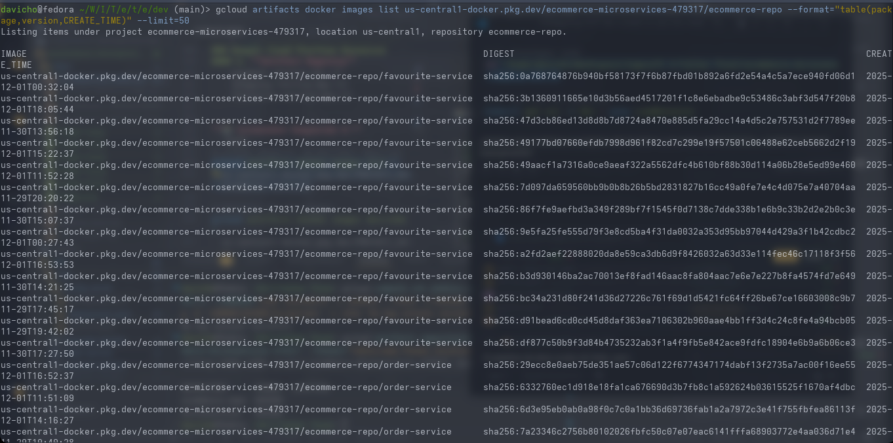
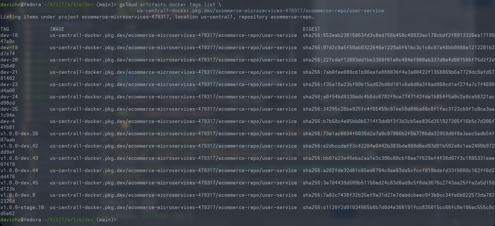


```bash
# Listar imágenes en Artifact Registry
gcloud artifacts docker images list \
  us-central1-docker.pkg.dev/ecommerce-microservices-479317/ecommerce-repo \
  --format="table(package,version,CREATE_TIME)" --limit=50

# Ver todas las versiones de una imagen
gcloud artifacts docker tags list \
  us-central1-docker.pkg.dev/ecommerce-microservices-479317/ecommerce-repo/user-service
```

#### 4. **Compute Engine (Jenkins)**

**VM Configuration:**
```
Name: jenkins-server
Machine Type: e2-standard-2 (2 vCPUs, 8 GB memory)
Zone: us-central1-a
Disk: 50 GB SSD persistent disk
OS: Ubuntu 22.04 LTS
Network: ecommerce-vpc
External IP: 34.123.43.189 (static)

Installed Software:
  - Jenkins 2.4xx
  - Docker 24.0.x
  - kubectl 1.28.x
  - gcloud SDK
  - Terraform 1.5.x
```

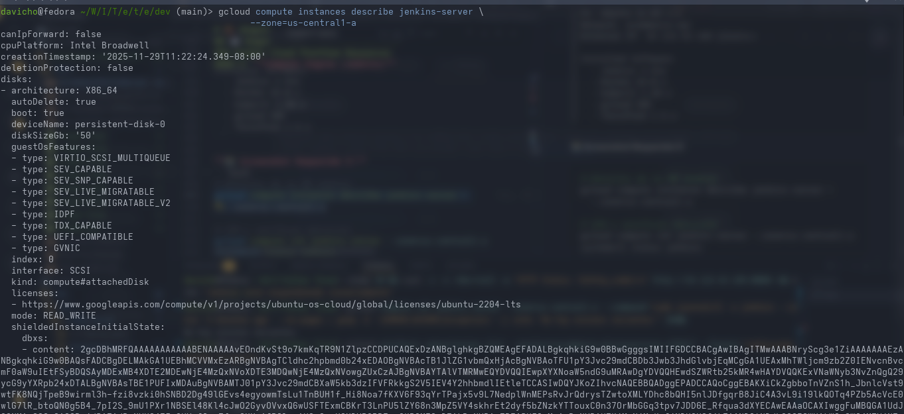
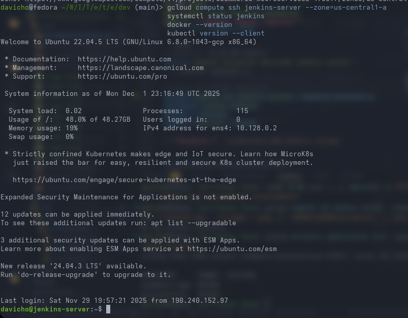

```bash
# Detalles de la VM Jenkins
gcloud compute instances describe jenkins-server \
  --zone=us-central1-a

# SSH y verificar servicios
gcloud compute ssh jenkins-server --zone=us-central1-a
systemctl status jenkins
docker --version
kubectl version --client
```

---

## 🎨 Patrones de Diseño Implementados

### 1. **Circuit Breaker Pattern** (Resilience4j)

**Implementación en api-gateway:**


**Configuración (application.yml):**

```yaml
resilience4j:
  circuitbreaker:
    instances:
      productService:
        registerHealthIndicator: true
        slidingWindowSize: 10
        minimumNumberOfCalls: 5
        permittedNumberOfCallsInHalfOpenState: 3
        automaticTransitionFromOpenToHalfOpenEnabled: true
        waitDurationInOpenState: 10s
        failureRateThreshold: 50
        eventConsumerBufferSize: 10
        
  retry:
    instances:
      productService:
        maxAttempts: 3
        waitDuration: 1s
        enableExponentialBackoff: true
        exponentialBackoffMultiplier: 2
        
  bulkhead:
    instances:
      productService:
        maxConcurrentCalls: 10
        maxWaitDuration: 500ms
```

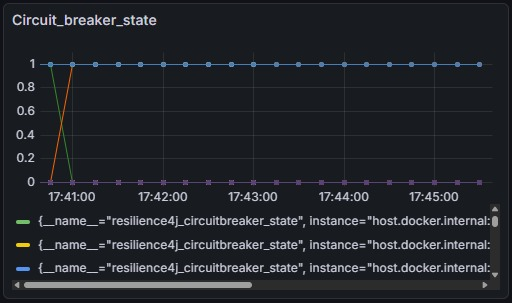

### 2. **Feature Toggle Pattern**

**Implementación en ¨Product Service:**


**Configuración dinámica (ConfigMap K8s):**

```yaml
apiVersion: v1
kind: ConfigMap
metadata:
  name: order-service-config
  namespace: dev
data:
  application.yaml: |
    features:
      express-shipping:
        enabled: true
        max-weight-kg: 50
      payment-installments:
        enabled: false
        max-installments: 12
        min-amount: 100
```

```
feature:
  product:
    count-enabled: false
```
```

---

## 🤔 Decisiones Técnicas

### 1. **¿Por qué GKE Standard en lugar de GKE Autopilot?**

**Decisión:** GKE Standard  
**Razones:**
- ✅ Mayor control sobre configuración de nodos (machine types, disk types)
- ✅ Flexibilidad para usar preemptible nodes y reducir costos
- ✅ Configuración personalizada de node pools
- ✅ Sin restricciones de Autopilot (privileged containers, DaemonSets)
- ✅ Mejor para aprendizaje y comprensión de Kubernetes
- ❌ Trade-off: Requiere más gestión manual de nodos

**Alternativa considerada:** GKE Autopilot  
**Por qué no:** Menos control sobre recursos, restricciones en configuraciones avanzadas, y costos potencialmente más altos para workloads de desarrollo

---

### 2. **¿Por qué Spring Cloud Netflix en lugar de Istio Service Mesh?**

**Decisión:** Spring Cloud Netflix (Eureka, Config Server)  
**Razones:**
- ✅ Más simple para equipos Java/Spring Boot
- ✅ Menos overhead de infraestructura
- ✅ Integración nativa con ecosystem Spring
- ❌ Trade-off: Menos features avanzados (traffic routing, circuit breaking a nivel de infraestructura)

**Alternativa considerada:** Istio + Envoy  
**Por qué no:** Overhead significativo para proyecto de tamaño mediano, curva de aprendizaje mayor

---

### 3. **¿Por qué Terraform en lugar de Deployment Manager (nativo GCP)?**

**Decisión:** Terraform  
**Razones:**
- ✅ Multi-cloud (portabilidad futura)
- ✅ Ecosystem más grande (providers, modules)
- ✅ Mejor soporte de la comunidad
- ✅ HCL más legible que YAML de Deployment Manager

**Alternativa considerada:** Google Cloud Deployment Manager  
**Por qué no:** Lock-in con GCP, menos flexible

---

### 4. **¿Por qué Jenkins en lugar de GitLab CI o GitHub Actions?**

**Decisión:** Jenkins  
**Razones:**
- ✅ Control total sobre pipeline (self-hosted)
- ✅ Plugins extensivos (Docker, Kubernetes, GCP)
- ✅ Groovy pipelines muy flexibles
- ❌ Trade-off: Mayor mantenimiento

**Alternativas consideradas:**
- GitHub Actions: Más simple pero menos control
- GitLab CI: Requiere GitLab instance

---

### 5. **¿Por qué separar repos de backend y operations?**

**Decisión:** 2 repositorios separados  
**Backend:** `ecommerce-microservice-backend-app`  
**Operations:** `ecommerce-microservice-operations`

**Razones:**
- ✅ Separation of concerns (código vs infraestructura)
- ✅ Diferentes ciclos de vida
- ✅ Permisos diferentes (devs vs devops)
- ✅ CI/CD independiente

**Alternativa considerada:** Monorepo  
**Por qué no:** Más complejo de gestionar, builds más lentos

---


